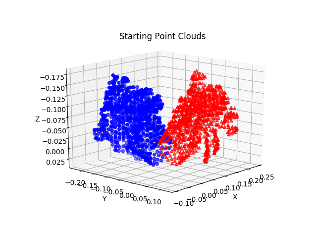
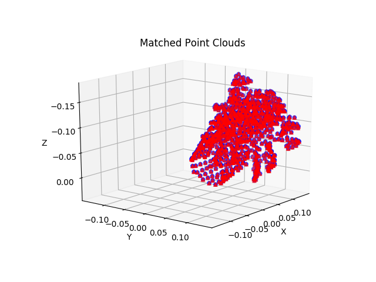

# Point-Feature-Histogram
Python implementation of PFH (Point Feature Histogram) and FPFH (Fast Point Feature Histogram).

# Project Description
PFH is an improvement upon the ICP (Iterative Closest Point) algorithm. This method uses a pose invariant feature descriptor for matching, which incorporates the geometric properties of an individual point's local neighborhood. FPFH is an additional variation of PFH where computation time is improved at the cost of a less descriptive feature descriptor.

# Installation
Requires Python3, Numpy, Scipy, Matplotlib. Install dependencies by:
```
pip install -r requirements.txt
```

# Example
The algorithm API works as follows:
```python3
icp = FPFH(et=0.1, div=2, nneighbors=8, rad=0.03)
result_cloud = icp.solve(source_pc, target_pc)
```

To run the demo code:
```
python demo.py
```

# Deliverables
`demo.py` runs the algorithm on an example dataset, producing a plot of the result.
`Paper.pdf` is a project report describing in detail the algorithm, implementation, and evaluation results.

# Results
Start | End
----- | -----
|

# Theory
- PCL documentation for [estimating surface normals](http://pointclouds.org/documentation/tutorials/normal_estimation.php#normal-estimation)
- PCL documentation for [PFH](http://pointclouds.org/documentation/tutorials/pfh_estimation.php)
- PCL documentation of [FPFH](http://pointclouds.org/documentation/tutorials/fpfh_estimation.php)
- Rusu [PhD thesis](http://mediatum.ub.tum.de/doc/800632/941254.pdf) and [papers](https://scholar.google.com/scholar?q=rusu+point+feature+histogram&hl=en&as_sdt=0&as_vis=1&oi=scholart)
